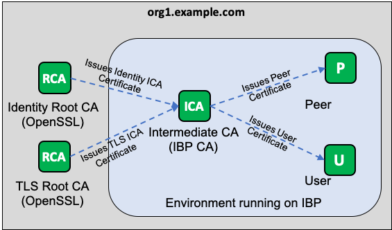
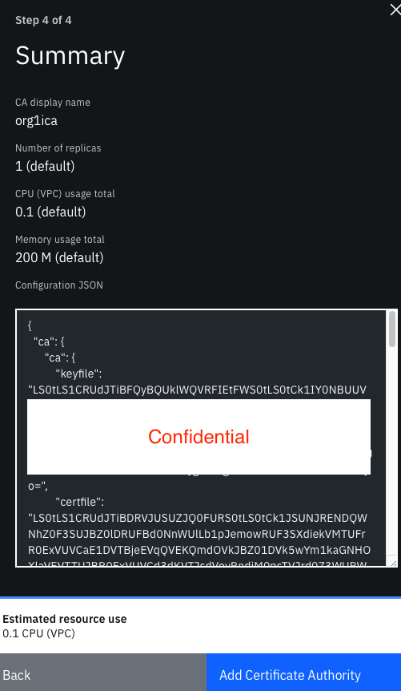

<!-- markdownlint-disable MD033 -->
# Creating Intermediate CA in IBM Blockchain Platform

Tested on IBP version: **2.1.3**



## Prerequisites

Ensure that you have the following:

* `jq`

Ensure that you have completed the previous [tutorial](README.md) and has not deleted `crypto-config` folder

## Tutorial

Copy the CA configuration template. You will need this JSON file to override the CA configuration in IBM Blockchain Platform

```bash
cp ica.json.template ica.json
```

In `ica.json`, observe that you need to fill in the following:

* `ca.ca.keyfile` - the Identity ICA's key
* `ca.ca.certfile` - the Identity ICA's certificate
* `ca.ca.chainfile` - the Identity ICA's chain certificates
* `tlsca.ca.keyfile` - the TLS ICA's key
* `tlsca.ca.certfile` - the TLS ICA's certificate
* `tlsca.ca.chainfile` - the TLS ICA's chain certificates

To retrieve `ca.ca.keyfile`:

```bash
export FLAG=$(if [ "$(uname -s)" == "Linux" ]; then echo "-d"; else echo "-b 0"; fi)
cat crypto-config/peerOrganizations/org1.example.com/ca/ica.identity.org1.example.com.key | base64 $FLAG
```

To retrieve `ca.ca.certfile`:

```bash
export FLAG=$(if [ "$(uname -s)" == "Linux" ]; then echo "-d"; else echo "-b 0"; fi)
cat crypto-config/peerOrganizations/org1.example.com/ca/ica.identity.org1.example.com.cert | base64 $FLAG
```

To retrieve `ca.ca.chainfile`:

```bash
export FLAG=$(if [ "$(uname -s)" == "Linux" ]; then echo "-d"; else echo "-b 0"; fi)
cat crypto-config/peerOrganizations/org1.example.com/ca/chain.identity.org1.example.com.cert | base64 $FLAG
```

To retrieve `tlsca.ca.keyfile`:

```bash
export FLAG=$(if [ "$(uname -s)" == "Linux" ]; then echo "-d"; else echo "-b 0"; fi)
cat crypto-config/peerOrganizations/org1.example.com/tlsca/ica.tls.org1.example.com.key | base64 $FLAG
```

To retrieve `tlsca.ca.certfile`:

```bash
export FLAG=$(if [ "$(uname -s)" == "Linux" ]; then echo "-d"; else echo "-b 0"; fi)
cat crypto-config/peerOrganizations/org1.example.com/tlsca/ica.tls.org1.example.com.cert | base64 $FLAG
```

To retrieve `tlsca.ca.chainfile`:

```bash
export FLAG=$(if [ "$(uname -s)" == "Linux" ]; then echo "-d"; else echo "-b 0"; fi)
cat crypto-config/peerOrganizations/org1.example.com/tlsca/chain.tls.org1.example.com.cert | base64 $FLAG
```

If required, you can modify the rest of the configurations by referring to [Fabric CA Server Config](https://hyperledger-fabric-ca.readthedocs.io/en/release-1.4/serverconfig.html).

In IBM Blockchain Platform, override the default configuration by using the previously modified JSON file


